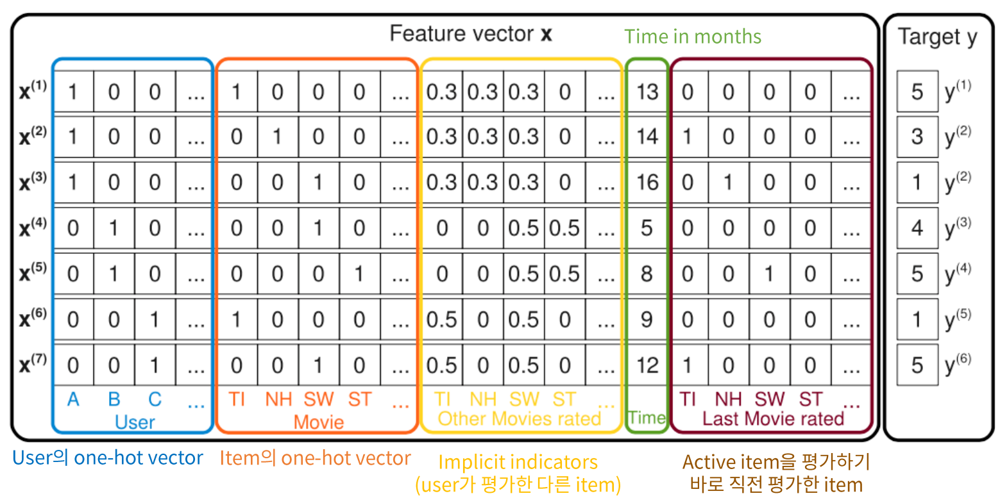
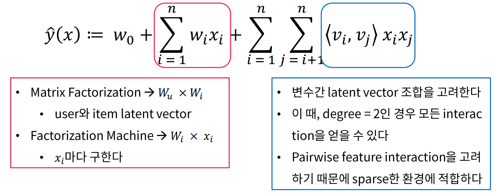
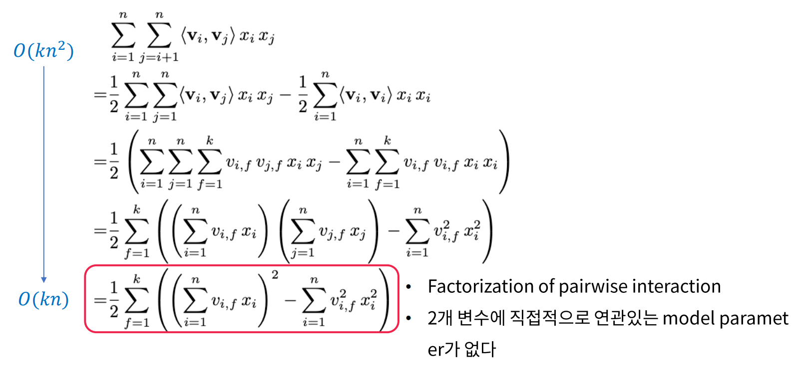

# Abstraction

1. Factorization Machine은 SVM과 Factorization Model의 장점을 합친 모델
2. Real Valued Feature Vector를 활용한 General Predictor 이다.
    1. classification, regression 도 풀 수 있음
3. Factorization Machine의 식은 linear time 이다.

# Introduction

1. SVM이 실패하는 very sparse한 상황에서도 파라미터 추정을 잘함
2. Linear complexity
3. FM은 실수를 feature vector로 사용하는 general predictor

# Prediction Under Sparsity

+ 모델의 구조

    

# Factorization Machines (FM)

1. Model Equation
    $$
    \hat{y}(x) = w_0 + \sum_{i=1}^nw_ix_i + \sum_{i=1}^n\sum_{j=i+1}^n<v_i,v_j>x_ix_j
    $$

    + $$
        \text{추정해야 하는 모수들 : } w_0 \in R, \bold{w} \in R^n, \bold{V} = R^{n\times k}, <v_i,v_j> = \sum_{f=1}^k v_{i,f}\cdot v_{j,f}
        $$

+ 설명
    + Pairwise feature interaction을 모두 고려하기 때문에, Sparse한 상태도 계산이 가능하다.

2. Computation : Linear

    + 맨 위 식의 경우 내적이 $k$, 이중합에서 계산이 $n^2$ 만큼 필요하다. 하지만 맨 아래식은 내적이 $k$, 시그마 안에서 $상수 \times n$ 만큼 계산량이 필요하다.

    

# Conclusion

1. feature vector X의 모든 가능한 interaction을 모델링

2. High Sparise 상황에서도 잘 작동함

3. 파라미터수, 학습과 예측 시간 모두 linear complexity

4. SGD를 활용한 최적화를 진행할 수 있고, 다양한 loss function을 사용할 수 있음

    