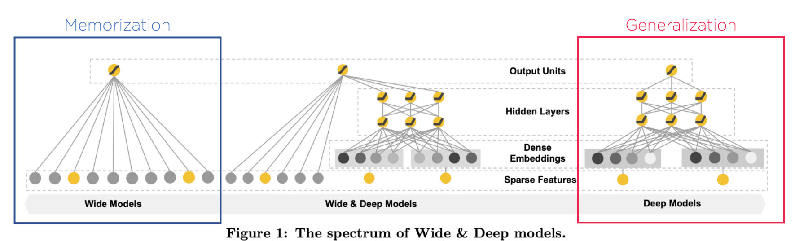
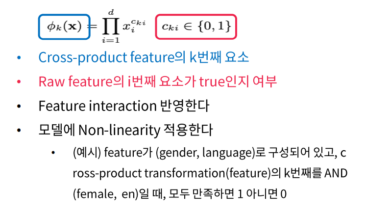
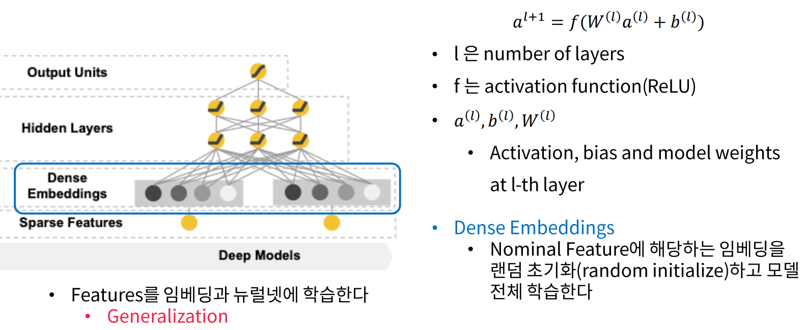
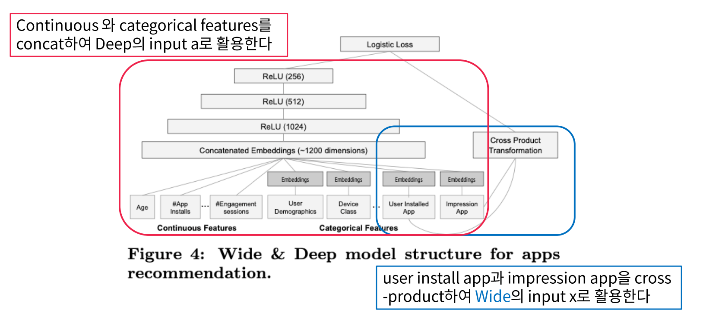

# Abstract

+ Wide : Memorization
    + 주어진 데이터를 그대로 외운다 + feature들의 interaction도 보면서 외운다.
    + Cross-product feature transformation 제안
    + Feature engineering에 많은 노력이 필요

+ Deep : Generalization
    + 보지 않은 데이터에 대해서 일반화
    + user-item interaction이 high sparse하면 over-generalize되어 너무 일반적인 추천 할 수도 있음
+ Wide & Deep
    + Jointly trained wide linear models & deep neural networks
    + memorization과 generalization의 장점을 결합함

# Introduction

+ Memorization 정의
    + interaction, correlation 을 모두 활용해서 과거 데이터 학습
+ Generalization 정의
    + Explore new feature combinations (새로운 feature combination을 생성)

+ 추천시스템에서 Memorization과 Generalization
    + Memorization : items와 직접적으로 관련이 있는 것들
    + Generalization : improve diversity of the recommendations

### 기존 추천 모델 한계

1. Generalized Linear Model
    + 로지스틱 회귀와 같은 모델에 다양한 feature를 만들어서 학습시킴
    + Memorization (주어진 데이터)에 특화됨
    + 새로운 데이터(unseen data)에는 취약
    + 오버피팅이 발생 가능
2. Embedding based Model
    + Factorization Machine, Deep Neural Network 방법을 활용
    + Generalization에 특화됨
    + Non-zero prediction으로 인해 섬세한 추천이 불가

# Contribution

1. Wide & Deep Learning framework를 제안
    1. Jointly training feed-forward neural network & linear model
2. Google Play에 상용화된 Wide & Deep 추천시스템의 평가와 구현 내용을 공개
    + 모바일 앱스토에서 App 구매, 다운로드 등 향상
    + 학습과 서비스 속도를 충족
3. Tensorflow 기반의 API를 오픈소스 형태로 제공

# Wide & Deep Learning

## [1] Framework

### wide component

$$
y = w^Tx + b
\\
\phi_k(x) = \Pi_{i=1}^dx_i^{c_{ki}}, \quad c_{ki} \in \{0,1\} : \text{ cross-product feature }
\\
where, x = [x_1, x_2, \ldots, x_d] : \text{ feature vector }
\\
w = [w_1, w_2, \ldots, w_d] : \text{ model parameter }
\\
b : \text{ bias }
$$

 

### deep component

+ feed forward nn을 활용

    

## [2] Joint Training

+ 추천 확률값

$$
P(Y=1|x) = \sigma(w^T_{wide}[x,\phi(x)] + w^T_{deep}a^{(l_f)}+b)
$$

# Conclusions

+ Memorization의 wide와 Generalization의 Deep을 결합한 모델을 제안
+ **Linear model과 embedding-based model의 장점을 잘 조합**함
+ 좋은 추천 알고리즘을 **실제 서비스 환경에서 작동할 수 있도록** 구현함
+ Open Source로 Tensorflow API로 구현